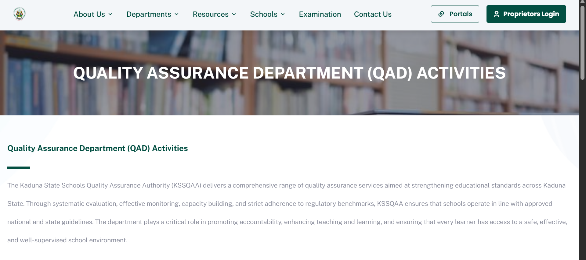

# Kaduna State Schools Quality Assurance Authority (KSSQAA) Web Platform

The official public-facing web platform for the Kaduna State Schools Quality Assurance Authority (KSSQAA), designed to deliver transparent access to state education standards, accreditation guidelines, news updates, and institutional resources.

> **Note:** This repository showcases the frontend user interface, layout architecture, and public component structure. Proprietary integrations, backend services, and server environment settings have been omitted for security.

---

## Overview & Purpose

* **Digital Public Gateway:** Provides public school administrators, private school proprietors, parents, and citizens across Kaduna State with direct access to quality assurance guidelines and policy documentation.
* **Accreditation & Quality Standards:** Outlines official criteria for school evaluations, registration procedures, and compliance expectations.
* **News & Field Updates:** Displays real-time updates on state-wide school monitoring drives, policy announcements, and educational interventions.
* **Modern Civic Web Design:** Clean, accessible, and fully responsive UI built to reflect state government authority and modern web design standards.

---

## Tech Stack

* **Frontend:** Vue.js (Composition API)
* **Styling:** BootstrapVue  / Custom UI System
* **Routing:** Vue Router
* **Build Tooling:** Vite / Vue CLI

---

## Interface Previews

| Official Homepage & Hero | Quality Assurance Department |
|---|---|
|  |  |
---

## Project Structure

```text
├── screenshots/          # Portal interface previews
├── src/
│   ├── assets/           # Images, logos, branding assets, and global CSS
│   ├── components/       # UI elements (Navbar, Footer, Announcement Banners, Cards)
│   ├── views/            # Main pages (Home, About Us, Guidelines, News, Contact)
│   └── router/           # Client-side routing configuration
└── README.md             # Platform overview and technical documentation